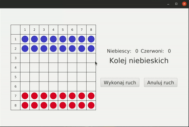

# Springers
Simple game for Object Oriented Programming classes
## Table of contents
* [General info](#general-info)
* [Technologies](#technologies)

## General info
Interactive "Springers" game - two players start with 16 pawns (like in chess or checkers) and try to move all their pawns to the opponent's starting fields. Moves allowed under the same rules as in checkers :
- move your pawn to any adjacent free field horizontally or vertically (forward, backward or sideways)
- jump over your own pawn or your opponent's pawn from the square directly adjacent to the pawn to be jumped onto the square directly behind it
- performing the entire series of jumps with one pawn in accordance with the previous rule - changing the direction of subsequent jumps is possible

  

Project made for Object Oriented Programming classes in the winter semester of the academic year 2021/22 at the Computer Science studies at AGH University of Science and Technology.

## Technologies
- Gradle
- Java
